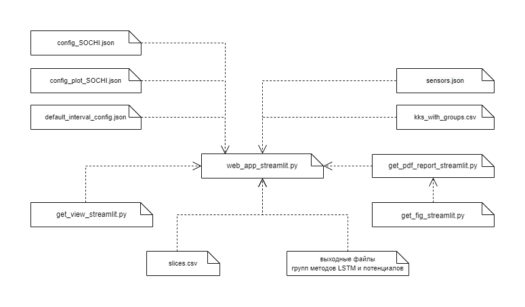

# Reports_variation
Возможность выделения интервалов и задания сглаживания в часах

## Назначение

Веб-приложение предназначено для визуализации графиков аномальных периодов, выделения аномальных интервалов и составления pdf-отчетов как по всем периодам, так и по конкретному периоду.

### В состав набора входят следующие скрипты:

- web_app_streamlit.py: запуск веб-приложения, инициализация директорий веб-приложения и элементов веб-страницы;
- get_view_streamlit.py: построение графиков и их отображение на веб-странице;
- get_interval_streamlit.py: выделение аномальных интервалов;
- get_fig_streamlit.py: построение графиков для pdf-отчетов;
- get_pdf_report_streamlit.py: составление pdf-отчетов.

Для работы workflow на выкаченных данных из онлайна используются специальные скрипты, собранные в директории `utils`:
- get_data.py: выкачка данных срезов, loss, вероятности по введенным датам начала и конца периода из таблиц онлайна методов потенциала и LSTM;
- get_default_interval.py: первоначальное сглаживание и выделение интервалов по стандартному конфигу `default_interval_config.json`;
- get_anomaly_interval.py: модуль с алгоритмами выделения аномальных интервалов;
- prepare_structure.py: скрипт создания структуры веб-приложения.

### Системные требования 

- streamlit>=1.19.0;
- pandas>=1.4.4;
- plotly>=5.18.0;
- loguru>=0.5.3;
- numpy>=1.23.5;
- reportlab>=3.5.68;
- scipy>=1.9.0;
- extra-streamlit-components>=0.1.56;
- streamlit_option_menu>=0.3.2;
- kaleido>=0.2.1.


### Установка пакетов
```
pip install -r requirements.txt
```
## Запуск веб-приложения

Для запуска веб-приложения достаточно выполнить команду:

```
python -m streamlit run web_app_streamlit.py -- --station SOCHI
```

Для просмотра версии веб-приложения достаточно выполнить команду:

```
python -m streamlit run web_app_streamlit.py -- --version
```

Для запуска веб-приложения на определенном порту выполнить команду:


```
python -m streamlit run web_app_streamlit.py  --server.port {указать номер порта} -- --station SOCHI
```

Для запуска веб-приложения на определенном порту и URL выполнить команду:

```
python -m streamlit run web_app_streamlit.py  --server.port {указать номер порта} --server.baseUrlPath {указать URL путь} -- --station SOCHI
```

### Структура веб-приложения

Веб-приложение имеет следующую структуру:
```
├───Data
│   │   kks_with_groups.csv
│   │   sensors.json
│   │
│   ├───csv_data
│   │       slices.csv
│   │
│   ├───LSTM
│   │   ├───csv_loss
│   │   │       loss_{номер группы}.csv
│   │   │
│   │   ├───csv_predict
│   │   │       predict_{номер группы}.csv
│   │   │
│   │   ├───csv_rolled
│   │   │       rolled_{номер группы}.csv
│   │   │
│   │   └───json_interval
│   │    		added_intervals_{номер группы}.json
│   │    		group_{номер группы}.json
│   │
│   └───Potentials
│       ├───csv_loss
│       │       loss_{номер группы}.csv
│       │
│       ├───csv_predict
│       │       predict_{номер группы}.csv
│       │
│       ├───csv_rolled
│       │       rolled_{номер группы}.csv
│       │
│       └───json_interval
│       		added_intervals_{номер группы}.json
│       		group_{номер группы}.json
│
├───web_app
│   │   config_plot_SOCHI.json
│   │   config_SOCHI.json
│   │
│   └───Reports
│       ├───LSTM
│       │   ├───group_{номер группы}
│       │   │   │
│       │   │   └───periods
│       │
│       └───Potentials
│       │   ├───group_{номер группы}
│       │   │   │
│       │   │   └───periods
│
├───uitls
    └───default_interval_config.json
```

- В папке `Data` лежат файлы, являющиеся исходными данными для отображения всех графиков: json файл KKS датчиков, csv файл с KKS датчиков и группами, файл со срезами, выходные файлы методов потенциалов и LSTM, фреймы со сглаженными вероятностями методов;
- В папке `web_app` помещены конфигурационные файлы;
- В папку `Reports` складываются все создаваемые отчеты.

Взаимосвязь используемых веб-приложением файлов поясняет диаграмма компоновки программных компонентов 


### Обязательные файлы для корректного запуска веб-приложения

Для корректного запуска веб-приложения обязательно необходимы следующие файлы, размещенные в соответствии со структурой веб-приложения:

- В папке `Data` разместить json файл KKS датчиков `sensors.json` и csv файл с KKS датчиков и группами `kks_with_groups.csv`;
- В папках исходных данных `Data/LSTM` и `Data/Potentials` разместить по директориям `csv_loss, csv_predict, csv_rolled, json_interval` соответствующие выходные файлы методов `loss_{номер группы}.csv, predict_{номер группы}.csv, rolled_{номер группы}.csv, group_{номер группы}.json`;
- В `Data/csv_data` разместить исходный для обоих методов csv файл со срезами `slices.csv`;
- В `Data/web_app` положить конфигурационные файлы `config_SOCHI.json`, `config_plot_SOCHI.json`;
- В `utils/` положить конфигурационный файл `default_interval_config.json`

Быстро создать структуру директорий веб-приложения можно с помощью запуска скрипта `prepare_structure.py`, расположенного в `utils`. Для этого необходимо последовательно выполнить обязательно переход в директорию `utils` и выполнить скрипт `prepare_structure.py`:  
```
cd utils
python prepare_structure.py
```

Файлы `loss_{номер группы}.csv, predict_{номер группы}.csv, rolled_{номер группы}.csv, group_{номер группы}.json` и `slices.csv` при необходимости можно выкачать из таблиц онлайна методов с помощью скриптов, размещенных в директории `utils`. Для этого необходимо выполнить следующую последовательность команд:

1. запустить скрипт выкачки данных get_data.py (начало и конец периодов указать в формате строки `"%Y-%m-%d %H:%M:%S"`):

```
python get_data.py -b {начало периода} -e {конец периода}
```

2. запустить скрипт первоначального сглаживания и выделения интервалов по стандартному конфигу `default_interval_config.json`

```
python get_default_interval.py
```

После выполнения скриптов в директории `utils` создадутся директории `csv_data`, `LSTM`, `Potentials`, которые содержат все необходимые для работы веб-приложения фреймы csv. Выкаченные фреймы следует скопировать в соответствующие директории веб-приложения, расположенные в `Data`.

#### Описание конфигурационного файла default_interval_config.json:

Конфигурационный файл default_interval_config.json имеет по умолчанию следующие поля:

`rolling`: сглаживание в часах.

`number_of_samples`: количество интервалов кратных 5.

`COUNT_TOP`: количество датчиков, которые внесли максимальный вклад в аномалию.

`SHORT_THRESHOLD`: порог для определения аномального значения для поиска коротких интервалов.

`LONG_THRESHOLD`: порог для определения аномального значения для поиска длинных интервалов.

`LEN_SHORT_ANOMALY`: настройка определяет минимальную длину короткого обнаруженного интервала аномалии.

`LEN_LONG_ANOMALY`: настройка определяет минимальную длину длинного обнаруженного интервала аномалии.

`COUNT_CONTINUE_SHORT`: количество отсчетов для прерывания короткого интервала.

`COUNT_CONTINUE_LONG`: количество отсчетов для прерывания длинного интервала.


### Описание конфигурационного файла config_SOCHI.json:

#### `Предупреждение` - наименование всех сохраняемых и входных файлов лучше не изменять.

Конфигурационный файл json имеет по умолчанию следующие поля:

`station`: наименование станции.

`project_name`: название проекта.

`count_of_groups`: количество групп ДТО.

`number_of_samples`: количество интервалов кратных 5.

`create_online_table`: если 1, то пересоздает и заполняет заново таблицы в БД для онлайн режима; если 0, то записи кладутся в существующую БД.

`source_input_data`: выбор источника входных данных. Следует указать какое-либо одно из следующих трех значений: {"clickhouse", "sqlite", "csv"}.

`N`: отсечка по мощности.

`blacklist_sensors`: массив KKS запрещенных датчиков - эти датчики не участвуют в работе метода.

`approx_sensors`: массив KKS отстраиваемых датчиков. Может содержать два датчика, тогда отстройка будет от двух параметров. Если внесен в массив один датчик, то отстройка идет от одного датчика. В массиве последним `всегда` указывается KKS датчика `мощности`.

`N_l`: количество точек для вычисления потенциала.

`delta`: время назад регрессии при вычислении времени до аномалии.

`s`: интервал взятия среза при вычислении времени до аномалии.

`P_pr`: уставка сигнализации по прогнозируемой вероятности.

`T_pr`: уставка сигнализации по расчетному времени до аномалии.

`delta_tau_P`: выдержка в часах для уставки сигнализации по вероятности.

`delta_tau_T`: выдержка в часах для уставки сигнализации по прогнозируемому времени.

`rolling`: сглаживание в часах.

`original_csv`: наименование csv файла с временными срезами значений датчиков всех групп (используется если `source_input_data`: "csv").

`original_kks`: наименование csv файла с KKS и принадлежностью датчиков группам (используется если `source_input_data`: "csv").

`original_group_csv`: наименование csv файла с номерами групп и их названием (используется если `source_input_data`: "csv").

`json_sensors`: наименование json файла с выделенными скриптом группами ДТО и датчиками.

`csv_truncate_by_power`: наименование csv файла со срезами, прошедшими отсечку по мощности.

`csv_train`: наименование csv файла со срезами для обучения коэффициентов отстройки по мощности.

`coef_train_json`: наименование json файла с коэффициентами регрессии.

`sqlite_norm`: наименование sqlite файла с нормализованными данными.

`points_json`: наименование json файла с отобранными точками (`заполнять без расширения с постфиксом: _`).

`potentials_csv`: наименование csv файла с вычисленными потенциалами (`заполнять без расширения с постфиксом: _`).

`loss_csv`: наименование csv файла с вычисленными loss (`заполнять без расширения с постфиксом: _`).

`probability_csv`: наименование csv файла с рассчитанными вероятностями (`заполнять без расширения с постфиксом: _`).

`table_potential_probability`: наименование csv файла-таблицы распределения потенциала вероятности (`заполнять без расширения с постфиксом: _`).

`threshold_json`: наименование json файла с пороговыми значениями (`заполнять без расширения с постфиксом: _`).

`anomaly_time_prob`: наименование csv файла с вычисленными временем до аномалии через вероятность (`заполнять без расширения с постфиксом: _`).

`save_models_prob`: наименование json файла с коэффициентами регрессии при вычислении времени до аномалии через вероятность (`заполнять без расширения с постфиксом: _`).

`anomaly_time_intercept`: наименование csv файла с вычисленными временем до аномалии через свободный член регрессии (`заполнять без расширения с постфиксом: _`).

`save_models_intercept`: наименование json файла с коэффициентами регрессии при вычислении времени до аномалии через свободный член регрессии (`заполнять без расширения с постфиксом: _`).

`intervals_json`: наименование json файла с выделенными аномальными интервалами (`заполнять без расширения с постфиксом: _`).

`clickhouse`: объект содержит запросы к БД clickhouse в случае выбора этой БД в качестве источника входных данных в поле `source_input_data`:

- `host_ip`: IP-адрес хоста БД clickhouse;

- `username`: имя пользователя БД clickhouse;

- `password`: пароль пользователя БД clickhouse;

- `original_csv_query`: запрос на получение временных срезов из clichouse;

- `original_kks_query`: запрос на получение KKS датчиков и принадлежностей их к группам из clichouse;

- `original_group_query`: запрос на получение наименования всех групп из clichouse.

`sqlite`: объект содержит запросы к БД sqlite в случае выбора этой БД в качестве источника входных данных в поле `source_input_data`:

- `original_csv`: наименование sqlite файла, содержащего временные срезы;

- `original_csv_query`: запрос на получение временных срезов из sqlite;

- `original_kks`: наименование sqlite файла, содержащего KKS датчиков и группы;

- `original_kks_query`: запрос на получение KKS датчиков и принадлежностей их к группам из sqlite;

- `original_group`: наименование sqlite файла, содержащего наименования всех групп;

- `original_group_query`: запрос на получение наименования всех групп из sqlite.

`hist_potential_probability`: наименование png файла с гистограммой распределения потенциала и вероятности (`заполнять без расширения с постфиксом: _`).

### Описание конфигурационного файла config_plot_SOCHI.json:

#### `Предупреждение` 

**Следует внимательно добавлять датчики в массивы DROP_LIST и PLOT_FEATURES. Также добавляемые датчики не должны противоречить настройкам конфига config_SOCHI.json.**

Конфигурационный файл json имеет по умолчанию следующие поля:

`station`: наименование станции.

`project_name`: название проекта.

`DROP_LIST`: массив KKS датчиков, которые не следует отображать.
    
`PLOT_FEATURES`: массив KKS датчиков, которые отображаются на многоосевых графиках периодов. Первые два KKS займут оси справа, остальные - оси слева. Максимум можно поместить 5 датчиков. По умолчанию на оси справа размещены датчики, от которых производится отстройка. 

